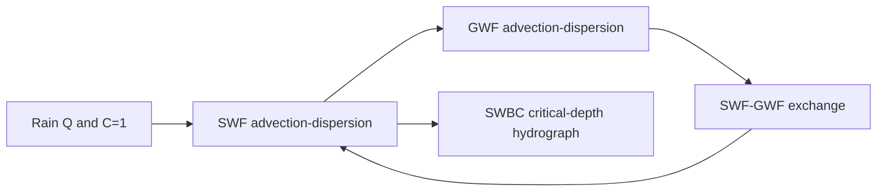

# Abdul transport verification (MUT + usgs_1)

## Target problem

HGS case [`D:\hgs\trunk\verification\abdul_transport`](D:\hgs\trunk\verification\abdul_transport) (`abdul_trans.grok`) is the Abdul hillslope with **coupled surface + subsurface solute transport**:

- Mesh: same 2-D GB grid as [`6_Abdul_Prism_Cell`](C:\Work\Examples-Release\6_Abdul_Prism_Cell) (15 GWF sublayers, dual-node / SWF surface).
- Rain: \(5.555\times10^{-6}\) m/s for 3000 s, then 0 for 3000 s.
- Solute `Rain`: \(D_m=2\times10^{-9}\) m²/s; third-type (Cauchy) \(C=1\) on top faces during rain, then \(C=0\).
- GWF: \(\alpha_L=1\), \(\alpha_T=\alpha_V=0.1\), tortuosity 1, \(n=0.34\), \(C_0=0\).
- Surface: \(\alpha_L=1\), \(\alpha_T=0.1\), coupling dispersivity 1, \(C_0=0\).
- Fully implicit transport (`transport time weighting 1.0`).
- Outputs to match: observation conc (`point1`, `well1` profile), flow hydrographs (`Outlet`, `Upstream`: Surface / PM / Total), mass balance.

MUT already builds the **flow** analog as `6_Abdul_Prism_Cell`. Clone that into a new Examples-Release folder (e.g. `6_Abdul_Transport`) and add transport instructions; do not invent a new mesh.

HGS third-type rain maps to USG **RCH option 4 + `CONCENTRATION`**, not PCB (PCB is Dirichlet).

---

## Can usgs_1 run this today?

**No.** `usgs_1` (`USG-TRANSPORT 2.7.1` in [`c:\_repo\Sorab\USG-Beta`](c:\_repo\Sorab\USG-Beta)) **does** solve GWF (and CLN) transport via BCT. It **does not** formulate transport on SWF nodes. This rainfall-on-surface problem cannot be matched until USG-Beta is extended.

What already works for GWF/CLN:

- NAM type `BCT` → [`GWT2BCT1AR`](c:\_repo\Sorab\USG-Beta\glo2btnu1.f) / `GWT2BCT1SOLVE`
- RCH keyword `CONCENTRATION` + per-SP `INCONC` ([`gwf2rch8u1.f`](c:\_repo\Sorab\USG-Beta\gwf2rch8u1.f), [`GWT2RCH1FM`](c:\_repo\Sorab\USG-Beta\gwt2bndsu1.f))
- OC `SAVE CONC` / `CONC SAVE UNIT`
- PCB (specified concentration), DPT/MDT, heat, chain decay
- SWF flow already copies exchange fluxes into `CBCH`/`CBCF` when `ITRNSP>0`

Blockers for Abdul:

| Need | usgs_1 today |
|------|----------------|
| Transport unknown on SWF nodes | Extra equations `N>NODES` are **CLN only** (`SGWT2BCT1CLN`). No `SGWT2BCT1SWF`. Storage uses `ACLNNDS` length; SWF would be wrong or crash if CLN is absent. |
| SWF porosity / depth volume | CLN uses conduit length × area, porosity 1. SWF needs area × flow depth (`SWF_THIK`). |
| Surface \(\alpha_L,\alpha_T\) | Not read for SWF. |
| HGS coupling dispersivity | `IDISPCLN` is CLN–GWF only. |
| SWF conc binaries | CLN conc save exists; SWF equivalents in [`swf2basu1.f`](c:\_repo\Sorab\USG-Beta\swf2basu1.f) are commented out. |
| OBPT concentration | [`ObsPt.f90`](c:\_repo\Sorab\USG-Beta\ObsPt.f90) writes Head/Sat/Depth only. |
| Named hydrographs | GAGE is SFR/LAK. SWBC flux is in CBB; no Outlet/Upstream time series of \(Q\) and \(QC\). |

MUT today: `iBCT` exists on the project type and NAM parser recognizes `BCT`, but **MUT never writes** a `.bct` file, RCH `CONC`, `SAVE CONC`, or post-process concentration. [`Introduction.tex`](Docs/User's Guide/Introduction.tex) still calls transport a future feature.

---

## Phase A — USG-Beta (required before a true match)

Work in [`c:\_repo\Sorab\USG-Beta`](c:\_repo\Sorab\USG-Beta). Keep GWF/CLN BCT behavior unchanged.

1. **Index extra nodes correctly** everywhere BCT assumes `N>NODES` is CLN:
   - CLN: `NODES+1 … NODES+NCLNNDS`
   - SWF: `NODES+NCLNNDS+1 … NEQS`
   - Storage/dispersion/mass/output loops in [`glo2btnu1.f`](c:\_repo\Sorab\USG-Beta\glo2btnu1.f) and [`gwt2bndsu1.f`](c:\_repo\Sorab\USG-Beta\gwt2bndsu1.f).

2. **`SGWT2BCT1SWF`**: if `INSWF>0`, read ICBUND (or copy flow IBOUND), SWF \(\alpha_L\)/`DLX`, \(\alpha_T\)/`ATXY`, SWF–GWF coupling dispersivity, initial \(C\). Porosity 1. Volume = cell area × smoothed depth.

3. **Advection**: use existing SWF face fluxes (`CBCF`) and SWF–GWF exchange (`CBCH`), same pattern as CLN–GWF.

4. **SWF conc I/O**: NAM `DATA(BINARY)` for `Modflow.SWF.CON`; OC `SAVE CONC` for SWF (mirror CLN `ICLNCN`).

5. **OBPT**: append `"Name Conc"` (species 1 first) to GWF/SWF/CLN Tecplot OBS files when `ITRNSP>0`.

6. **Hydrographs** (new small writer, not GAGE): named SWF cell sets write, each ATS/OC time:
   - volumetric flux (Surface = SWBC/critical depth; optional GWF-side exchange as “Porous media”; Total)
   - concentration and mass flux \(Q C\)
   ASCII Tecplot, HGS-like columns so MUT/dossier can overlay.

7. **RCH option 4 + CONC**: confirm `IRCH` global node numbers hit SWF `ICBUND`; Cauchy rain then works without PCB.

Suggested BCT flags for this case: `ITRNSP=1`, `MCOMP=1`, `IC_IBOUND_FLG=1`, `ITVD=0` (upstream; HGS upstream is commented out), `IDISP=1`, `DIFFNC=2e-9`, `TIMEWEIGHT 1.0`, no adsorption/decay/heat.

---

## Phase B — MUT writers

New domain owner (parser → writer), following GSTR/VEL: parser in [`MUSG_InstructionParser.f90`](MUSG_InstructionParser.f90), types in [`MUSG_Core.f90`](MUSG_Core.f90), writer in [`Modflow_USG.f90`](Modflow_USG.f90) or a new `MUSG_Transport.f90`.

### Instructions (HGS-like, domain-scoped)

Inside `build modflow usg`:

- `do transport` — enable BCT; write NAM `BCT`, conc binaries, OC `CONC SAVE UNIT` / `SAVE CONC`.
- Solute block: `solute` / `name` / `free-solution diffusion coefficient` → `DIFFNC`, `MCOMP`.
- Per domain (after materials): `longitudinal dispersivity`, `transverse dispersivity`, `vertical transverse dispersivity` (GWF), `coupling dispersivity` (SWF).
- `initial concentration` on chosen cells (default 0).
- With `swf recharge` / `gwf recharge`: optional `recharge concentration` (stress-period value) → RCH header `CONCENTRATION`, `IRCHCONC`, per-SP `INCONC` + CONSTANT/INTERNAL conc array. SP2 uses \(C=0\) (or reuse with explicit 0).
- `transport time weighting` → BCT `TIMEWEIGHT`.
- Optional later: `pcb` / specified concentration (not needed for Abdul rain).

GWF porosity already lives in `GWF.csv` (`Porosity` in [`Materials.f90`](Materials.f90)) and is written to VEL; BCT `PRSITY` can reuse the same layer arrays.

### Files MUT must emit

- `Modflow.bct` — options + scalars + GWF arrays (ICBUND, PRSITY, DLX/ATXY/ATYZ/ATXZ, CONC) + SWF block once usgs_1 reads it.
- NAM: `BCT`, `DATA(BINARY) Modflow.GWF.CON` (and `.SWF.CON`).
- OC: `CONC SAVE UNIT` + `SAVE CONC` each period ([`WriteGWFFiles` OC block](Modflow_USG.f90) ~7047–7070).
- RCH: option-line `CONCENTRATION` / `IRCHCONC`; each SP `INCONC` + conc array ([`AssignRCHtoDomain`](MUSG_BoundaryConditions.f90) currently writes only `nRCHoption, iCBB`).
- OBPT: unchanged cell lists; usgs_1 adds conc columns. MUT comment in [`MUSG_ObservationPoints.f90`](MUSG_ObservationPoints.f90) already anticipates conc.
- Hydrograph instruction: `set hydrograph cells` / named GB echos (Outlet, Upstream) → new `Modflow.hydg` (or OBS-like) that usgs_1 fills.

### `_post` and dossier

- Read GWF/SWF conc binaries; add `Concentration` (or species name) to `{domain}` SZPLT.
- Hydrograph Tecplot + `{domain}_Observations.lay` / new `Transport_Hydrographs.lay`.
- [`Tools/mut_document/`](Tools/mut_document/) concentration flood + overlay vs HGS `*.observation_well_conc.*` and `*.hydrograph.*`.

### Docs

- New [`Docs/User's Guide/Transport.tex`](Docs/User's Guide/Transport.tex); include from the User's Guide.
- Extend [`3D_Abduls_Problem.tex`](Docs/User's Guide/3D_Abduls_Problem.tex) or a short verification subsection.
- [`Introduction.tex`](Docs/User's Guide/Introduction.tex): drop “future transport”; mass dimension \(M\) is live.
- [`DOMAIN_MAP.md`](Docs/ai/DOMAIN_MAP.md), [`PROGRESS.md`](Docs/ai/PROGRESS.md).
- Version bump: `MUTVersion` + title page + [`Modifications.tex`](Docs/User's Guide/Modifications.tex) only when this ships.

---

## Phase C — Example and comparison

- Folder: `C:\Work\Examples-Release\6_Abdul_Transport` (copy `6_Abdul_Prism_Cell` inputs: `gb/`, `GWF.csv`, `SWF.csv`, `SMS.csv`).
- `_build.mut`: existing flow block + transport verbs; observation points aligned with HGS `point1` / `well1` / Outlet; hydrograph cell sets from `./gb/grid.nchos.Outlet` and `Upstream` (same as HGS).
- `Run.MUTBatch`: `mut _build` → `usgs_1` → `mut _post`.
- Compare (not bit-for-bit with HGS): outlet flow hydrograph, outlet conc/mass flux, `well1` vertical \(C(z,t)\), mass-balance Tmass vs HGS `mass_balance_summary.Rain.dat`.
- Publish via `ToRepos.bat` only after a successful run.

Known flow-side differences to keep in mind (already true of Abdul flow): MUT SWF vs HGS dual nodes; MUT critical depth at channel outlet only vs HGS outlet + remaining boundary; MUT initial SWF depth \(10^{-4}\) vs HGS \(10^{-8}\); mesh-centered prisms vs HGS FD. Transport match will inherit those.

---

## Suggested sequence

1. USG-Beta: SWF node indexing + `SGWT2BCT1SWF` + conc save (can unit-test on a 1-cell SWF+GWF column).
2. MUT: `do transport` + BCT/RCH-CONC/OC/NAM (GWF-only first, then SWF arrays).
3. usgs_1 OBPT conc + hydrograph writer; MUT instructions to generate those inputs.
4. Stand up `6_Abdul_Transport` and iterate parameters (`ITVD`, coupling dispersivity, ATS) against HGS plots.
5. User's Guide + dossier layouts; `verify_release.ps1` once the example is in `Run.MUTBatch`.
